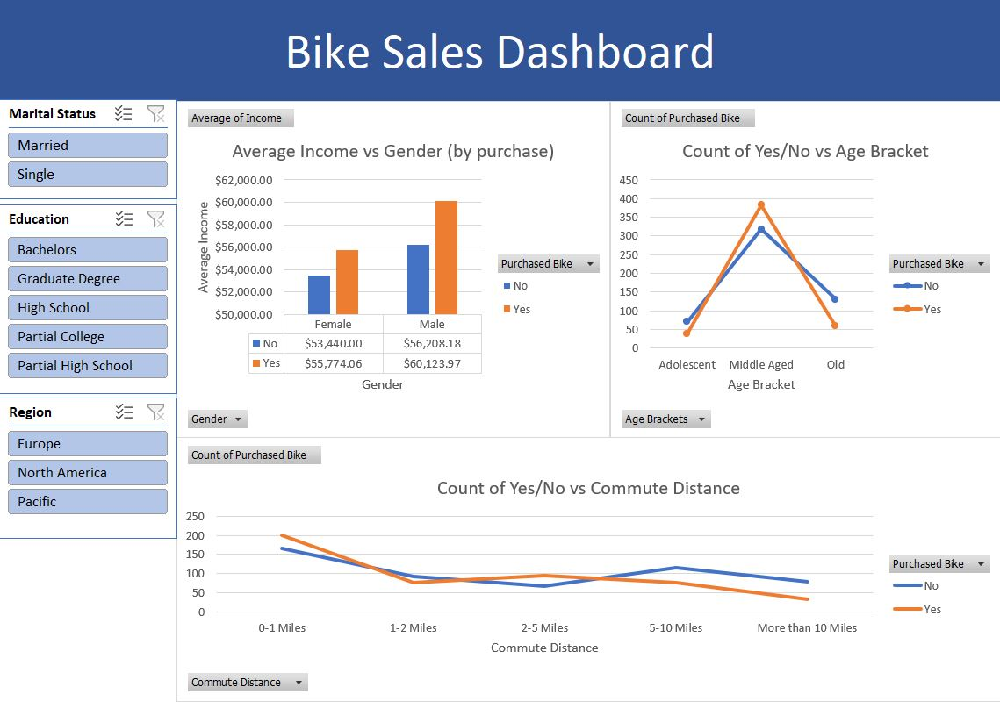

# Bike-Sales-Analysis-Dashboard

This project is an interactive dashboard built using Excel, designed to analyze and visualize bike sales data. The primary objective of this project is to provide insights into various factors influencing bike purchases, such as gender, age, income, and other demographic details. The dashboard presents data in a user-friendly format with visualizations and slicers for dynamic interaction.

## Project Overview

The dataset used for this analysis includes the following columns:
- **ID**
- **Marital Status**
- **Gender**
- **Income**
- **Children**
- **Education**
- **Occupation**
- **Home Owner (Yes/No)**
- **Cars**
- **Commute Distance**
- **Region**
- **Age**
- **Purchased Bike (Yes/No)**

### Key Steps in the Analysis

1. **Data Cleaning**: 
   - Removed duplicates from the dataset.
   - Standardized categorical values for better readability (e.g., "M" to "Married", "F" to "Female").
   - Removed the dollar sign from the "Income" column to ensure data is usable for analysis.

2. **Data Validation**:
   - Used Excel's filter function to verify the accuracy of values in the columns: Children, Education, Occupation, Home Owner, Cars, Commute Distance, and Region.

3. **Age Categorization**:
   - Created an additional column to classify individuals into three age categories:
     - **Adolescent**: Age < 31
     - **Middle-aged**: 31 ≤ Age < 54
     - **Old**: Age ≥ 54

4. **Pivot Table Analysis**:
   - Generated pivot tables to explore relationships between key variables:
     - Average income by gender and bike purchase status.
     - Count of bikes purchased vs. not purchased by commute distance.
     - Count of bikes purchased (yes and no) by age bracket.
   - Created charts to visualize the findings from the pivot tables.

5. **Dashboard Creation**:
   - Removed gridlines for a cleaner interface.
   - Added pivot chart visualizations to the dashboard.
   - Incorporated slicers to enable interactive filtering of the data across visualizations.

## Features

- **Interactive Dashboard**: Users can interact with the data using slicers, making it easy to explore different segments and gain insights on bike purchases.
- **Charts & Visualizations**: Pivot charts display relationships between variables like gender, income, age, and bike purchases.
- **Data Cleanliness**: Comprehensive data cleaning and categorization steps ensure the data is ready for meaningful analysis.

## Technologies Used

- Microsoft Excel (Pivot Tables, Pivot Charts, Slicers)

## How to Use

1. **Download the Excel file** from this repository.
2. Open the file in Microsoft Excel.
3. Interact with the dashboard by selecting different options using the slicers to filter the data and explore various visualizations.
4. You can also modify the dataset or slicers to analyze new data or adjust the dashboard according to your needs.

## Project Structure

- **Bike_Sales_Analysis.xlsx**: The main Excel workbook containing all the data, pivot tables, charts, and the dashboard.
- **README.md**: This file, containing an overview of the project and instructions.

- 
